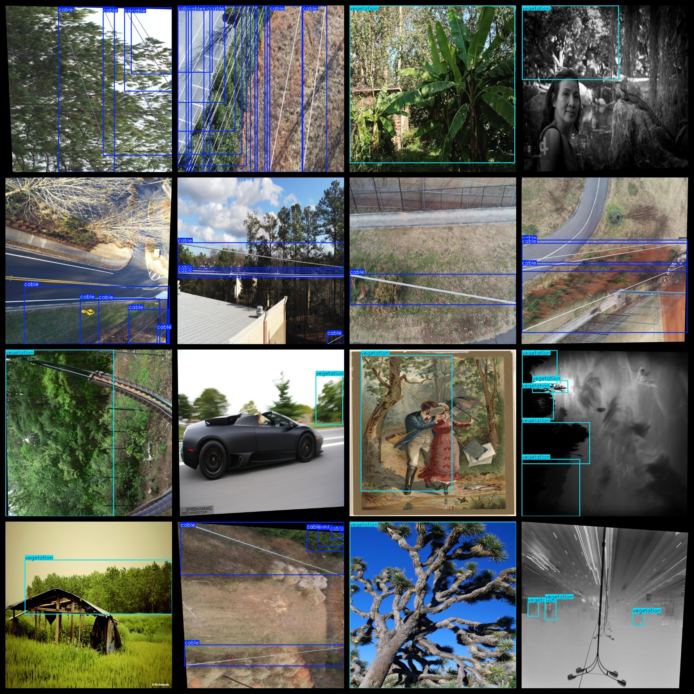
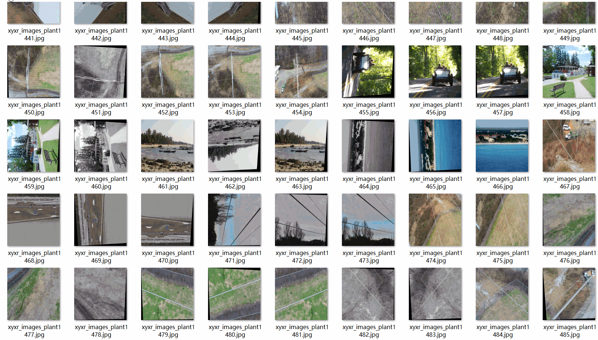

# UAV Aerial Cable Vegetation Detection Dataset 6187 images VOC+YOLO format

The dataset is a UAV aerial cable vegetation detection dataset with 6187 images in VOC+YOLO format. It includes three folders: JPEGImages, Annotations, and labels. The JPEGImages folder contains a total of 6187 jpg images, the Annotations folder contains a total of 6187 xml files, and the labels folder contains a total of 6187 txt files. There are two types of labels: "cable" and "vegetation".

The number of boxes for each label (note that the yolo format category order does not correspond to this, but rather to the classes.txt in the Annotations folder):

- cable boxes = 18918
- vegetation boxes = 14333
- total boxes = 33251

The image resolution is clear. The images have been enhanced. The GitHub repository location is datasets_sl. The shape of the labels is rectangular boxes, used for target detection recognition.

Important notes: No 001 has been added.
Special declaration: This dataset does not guarantee the accuracy or weights of the trained models, only accurate and reasonable annotations are provided.

## Images

---

Here is a pay link on Stripe (https://buy.stripe.com/3cs8yP7sY87d0vu9AB). Please contact me lonlonago@foxmail.com after funding $89, and I will send you a complete data files, thank you!

